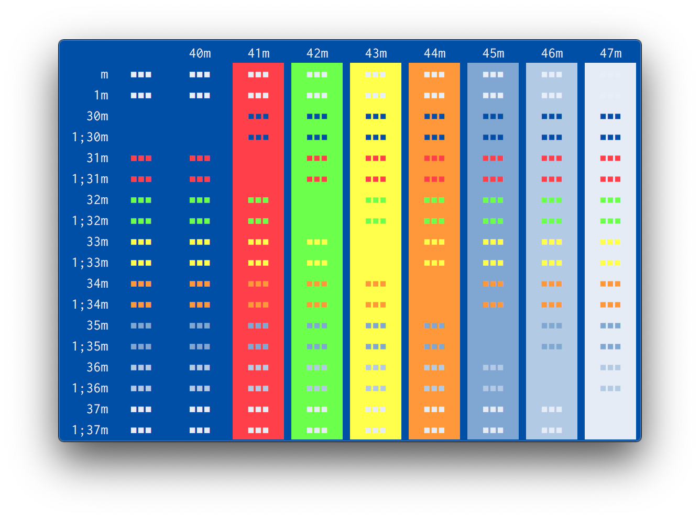
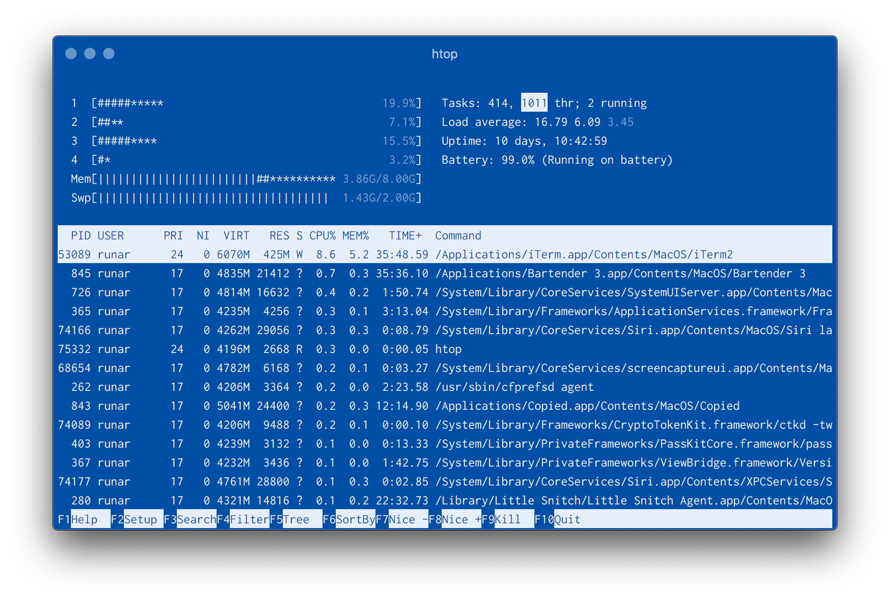
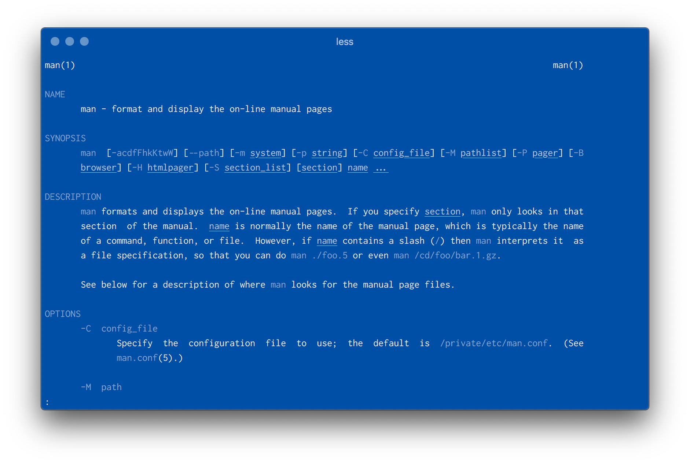
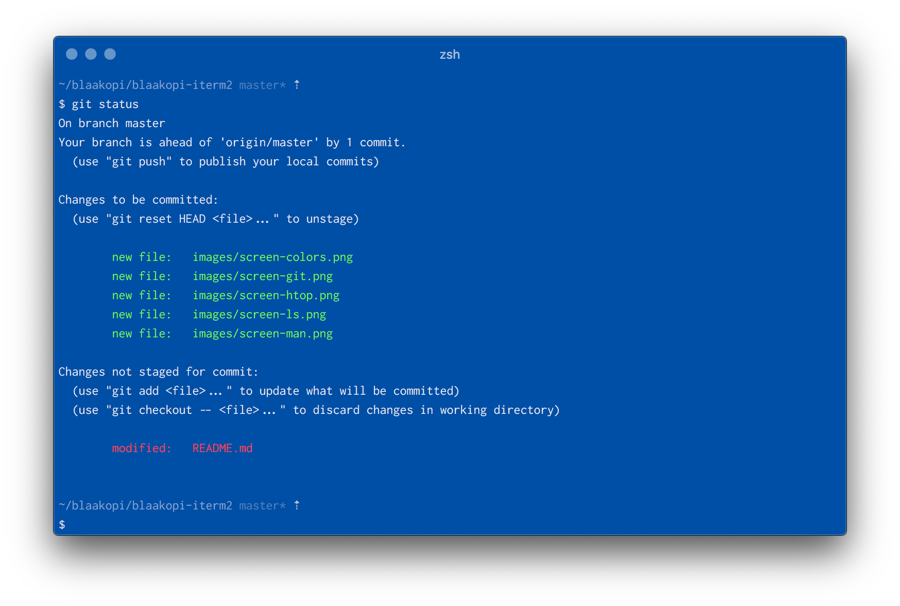
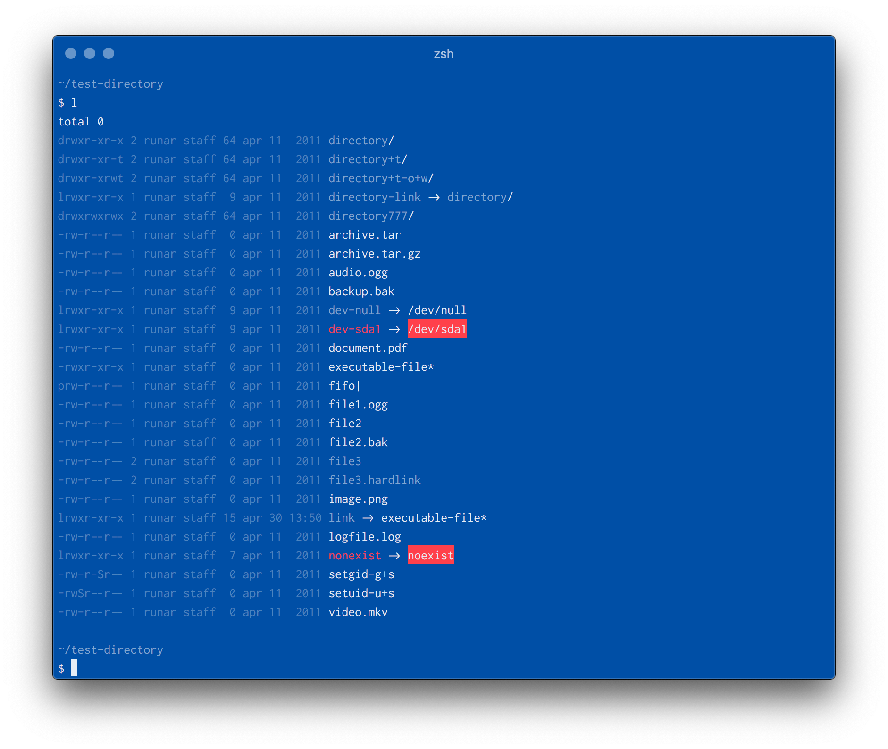

# blaakopi iterm2

This is a color scheme for iTerm2, based on the [blaakopi] color palette.
Blaakopi is a simple color palette inspired by the old concept of blueprints.
It's minimalistic, very blue, and almost monochromatic, and certainly not for
everyone.



## Usage

### Installation

1. Download [`blaakopi.itermcolors`](blaakopi.itermcolors) and double-click the
   downloaded file.
2. In iTerm2, go to *Preferences > Profiles* and open the Colors tab.
3. Click *Color Presets…*, and select *blaakopi*.

### Colorize command line tools

Some command line tools, such as `htop`, `ls`, and `man`, support colorizing
their output.  Most tools use the terminal color scheme (ansi colors), and the
default colors will probably work just fine.  To get the most out of blaakopi,
though, you might want to redefine which colors are used where.  In this
section, you will find a few suggestions for a handful of these tools.

#### `htop`

Themes and colors in `htop` are hardcoded, and you would have to rebuild `htop`
in order to add custom themes.  So, the built-in theme that works best with
blaakopi is the *Monochromatic* theme.  To use this theme in `htop`, follow
these instructions:

1. Press `F2`, and move down to *Colors* using your down arrow key.
2. Move to the right column using your right arrow key, and select the
   *Monochromatic* theme using the space bar.
3. Press `F10` to save.

#### `man` and `less`

The easiest way to add colors to `man` and `less`, is by setting termcap
capability variables using the [`termcap(5)`] feature.  Add the following
snippet to your `.profile` or `.zshrc`, and `man` and `less` will use the
appropriate blaakopi colors:

```bash
export GROFF_NO_SGR=1                                 # for konsole and gnome-terminal
export LESS_TERMCAP_mb=$(tput bold; tput setaf 13)    # start blinking
export LESS_TERMCAP_md=$(tput bold; tput setaf 13)    # start bold mode
export LESS_TERMCAP_me=$(tput sgr0)                   # end blinking/bold mode
export LESS_TERMCAP_so=$(tput setab 8)                # start standout mode
export LESS_TERMCAP_se=$(tput sgr0)                   # end standout mode
export LESS_TERMCAP_us=$(tput smul; tput setaf 14)    # start underlining
export LESS_TERMCAP_ue=$(tput rmul; tput sgr0)        # end underlining
```

To read more about `termcap`, take a look at [this question] on Stack Exchange.

#### `ls`

One way to modify the colors of `ls`, is to use the `dircolors` tool.  Go to
the [blaakopi dircolors] color scheme and follow the instructions.

## Screenshots

All screenshots below are captured in iTerm2 on MacOS, using the Inconsolata
font.






## Contribution

Please post issues and bugs, feature requests and suggestions, and general
feedback in the [issue tracker].

[blaakopi]: https://github.com/runar/blaakopi
[blaakopi dircolors]: https://github.com/runar/blaakopi-dircolors
[issue tracker]: https://github.com/runar/blaakopi-iterm2/issues
[`termcap(5)`]: http://linux.die.net/man/5/termcap
[this question]: https://unix.stackexchange.com/questions/108699/documentation-on-less-termcap-variables
